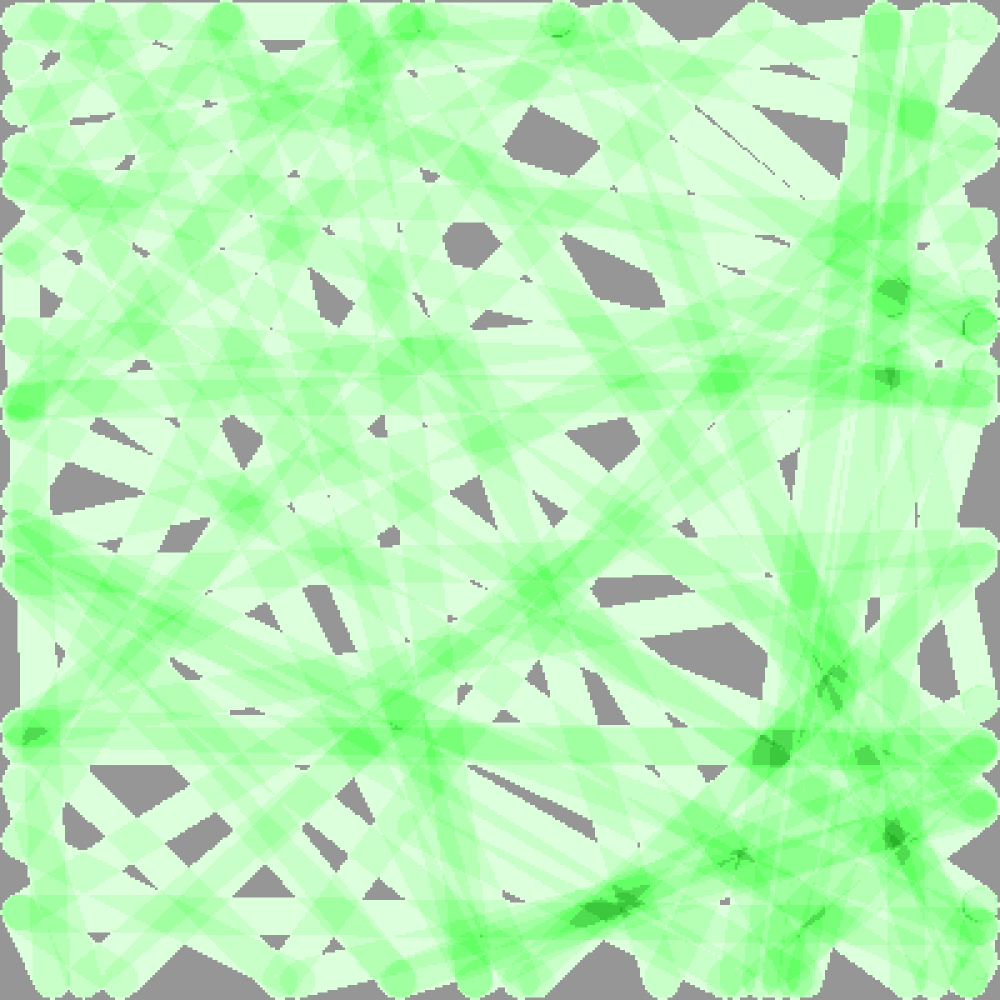
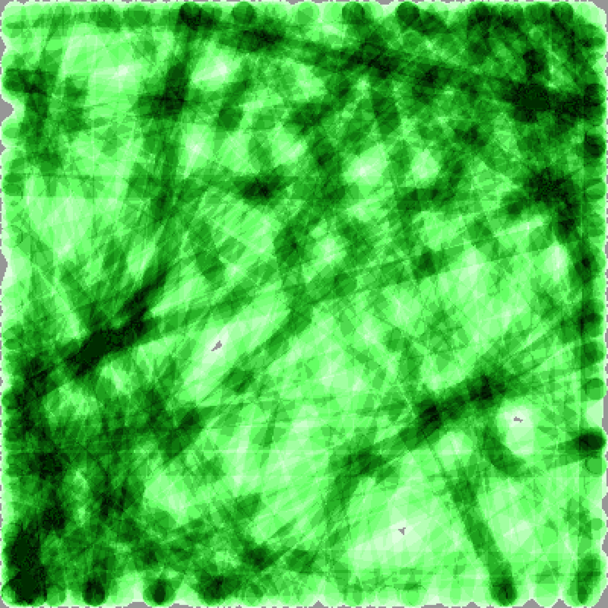
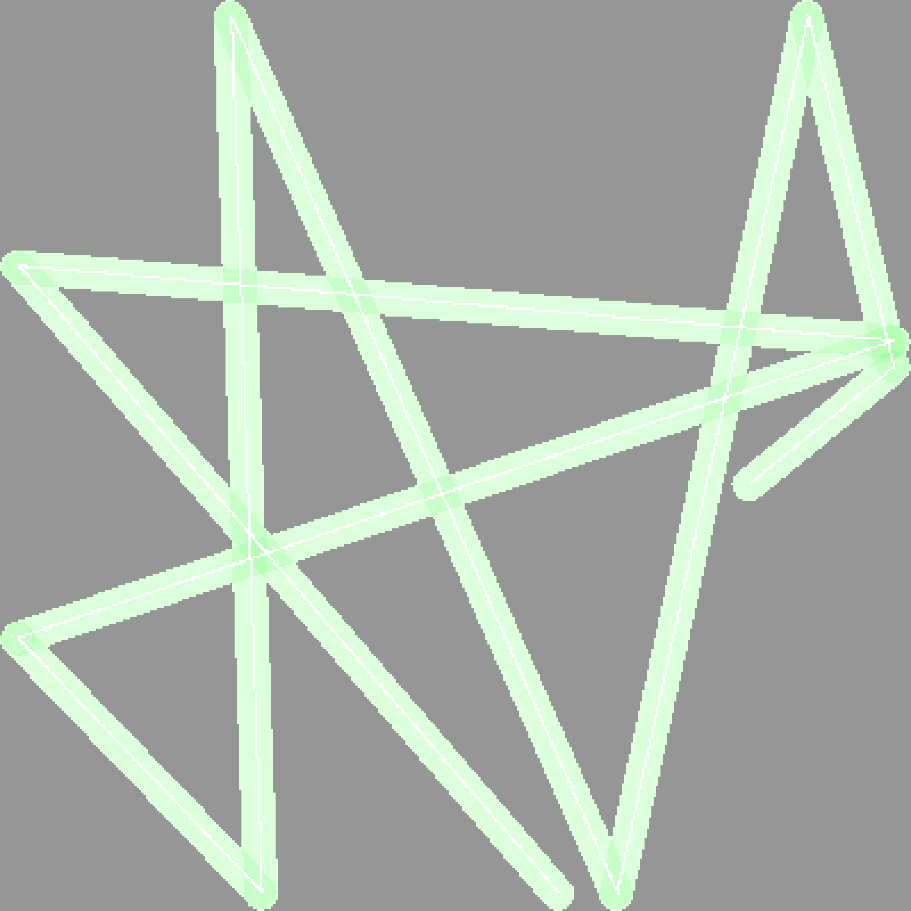
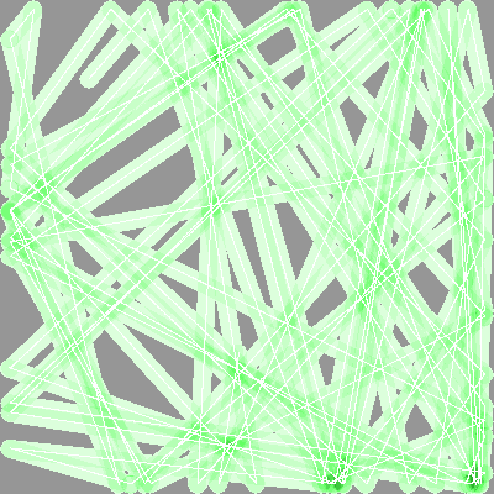
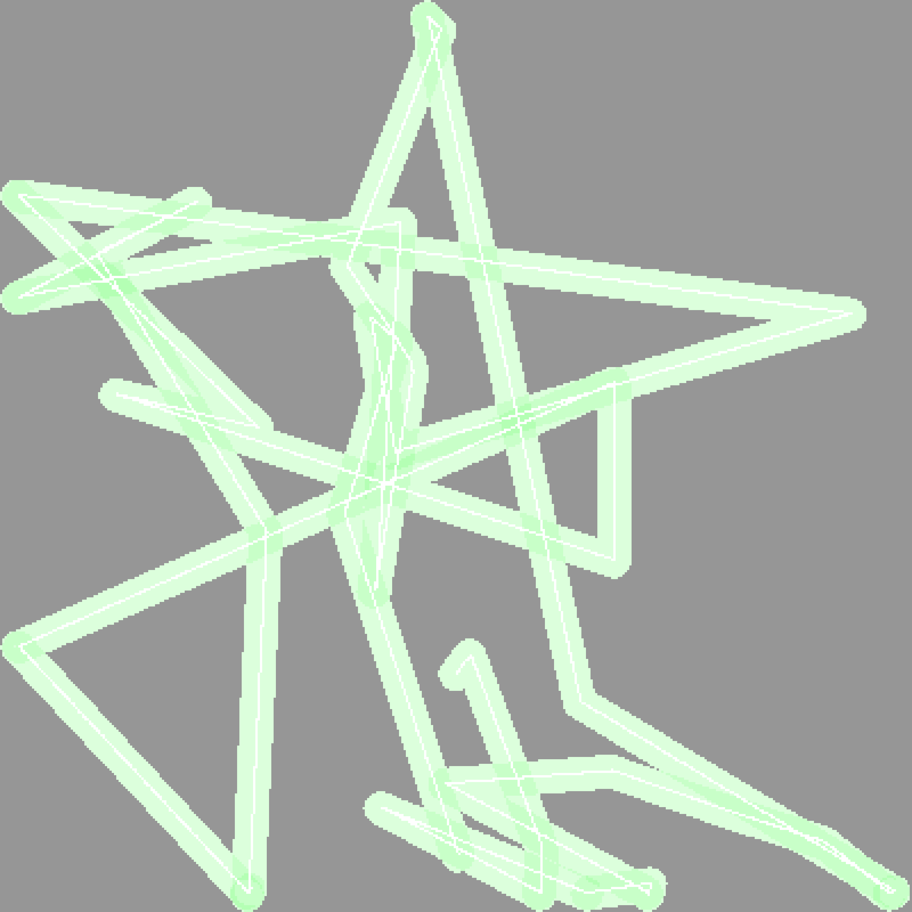

# GridCover - Autonomous Lawn Mower Simulation

GridCover is a simulation program that models how an autonomous lawn mower "cutter" cuts grass in a large rectangular area with optional obstacles. The simulation tracks the circular cutting path of the mower as it moves across the lawn, bouncing off boundaries and changing direction according to the defined strategy to achieve complete grass coverage.

## Overview

This program simulates a robotic lawn mower with a circular cutting blade that moves across a rectangular lawn area. The mower follows a realistic physics model where:

- The area is based on a rectangular grid where obstacles can be placed by speficying a map file
- The mower moves in straight lines with optional§ probability based perturberation until it hits a boundary
- Upon hitting a boundary, it bounces off at an angle (with optional random perturbation)
- The simulation tracks which areas of the lawn have been completely covered by the cutting blade
- The program generates a PNG images showing the coverage pattern together with detailed data of the result of the simulation.
- Two different type of cutter geometry can be used: Circular and blade. A circular cutter models a traditional lawn mower where the knife covers the entire radius of the rotating cutter. The blade types models modern robotic cutters where a 3-4cm knife is attached to the edge of a rotating disc.
- To give an accurate estimation of the simulated time an optional battery run-time and charge time can be specified (tis will also include a simulated time for the cutter to find its charging station)
- The result and model parameters can optionally be stored in a SQLite database for later analysis.

## Summary of main features

- **Realistic physics** with configurable mower radius, speed, and direction perturbation
- **Multiple stopping conditions** (bounces, time, coverage percentage, distance, or simulation steps)
- **Visual output** with color-coded PNG images showing coverage patterns
- **Reproducible results** using random seeds for deterministic simulations
- **Flexible configuration** with extensive command-line options


## Installation from package

### MacOS

The distribution have pre-built packages for both Apple silicon and Intel architecture.
These packages can be installed either from *Finder* by double-clicking on the file or the command line with:

```bash
installer -pkg <pkg-name>
```

by default the program wil be installed in `/usr/local/bin`

## Installation from source

Ensure you have Rust installed on your system. If not, install it from [rustup.rs](https://rustup.rs/).

Clone the repository and build the project:

```bash
git clone <repository-url>
cd gridcover
cargo build --release
```

## Usage

### A note on units

The simulation is based on the concept of a unit length. As long as all metrics are given in a consistent way, the unit can be interpretated as either dm, m, km etc. From a practical point it is though probably easiest to think of all measures  as given in meters.


### Basic Usage from source

Run a basic simulation with default parameters. For more complex use cases refer to the "User manual"

```bash
gridcover --stop-coverage 50 -R true
```
or the equivalent with short arguments
```bash
gridcover -c 50 -R true
```

This will simulate a lawn mower with:
- A lawn 10x10 unit size (with default values for speed, radious etc. this is consistent with a 10x10m grid)
- The area will be divided in 500x500 cells (each 0.02 unit size)
- Each cell representing 0.025 unit × 0.025 units
- Run the simulation until 50% of the lawn has been cut
- Circular cutting size is 0.2 units (default)
- Random starting direction
- Random starting position

## Map file format

The map file is given in YAML format. Obstacles can be specified as
- Rectangles: Specified as lower left coordinates together with width and height
- Circles: Specified by center point and radius
- Polygons: Specified as list of points. Note auto-closes the polygon so all points should be unique.
- Lines: Specified as two points and thickness

All obstacles are specified in world coordinates.

Example map file:
```yaml
name: "My Backyard"
description: "A backyard with a pond and patio"

# Optional override of grid-size. We can interpret the measures as being given in meters.
grid:
  width: 25 
  height: 50 

obstacles:
  # Rectangle obstacles (x, y are bottom-left coordinates)
  - type: rectangle
    x: 10
    y: 10
    width: 8
    height: 10
    name: "Patio"
    
  # Circle obstacles (x, y are center coordinates)
  - type: circle
    x: 15
    y: 30
    radius: 3
    name: "Pond"
 
  # Polygon obstacles (defined by a series of points)
  - type: polygon
    points:
      - [20, 45]
      - [15, 35]
      - [20, 25]
      - [15, 15]
    name: "Flower Bed"
    
  # Line obstacles (useful for narrow barriers like fences)
  - type: line
    points:
      - [0.1, 47]
      - [10, 47]
    width: 0.2
    name: "Fence"
```

## All Command Line Arguments Grouped

### Grid Configuration
- `-W, --width <WIDTH>` - Grid width in units (default: 10)
- `-H, --height <HEIGHT>` - Grid height in units (default: 10) 
- `-s, --cell-size <CELLL_SIZE>` - Size of each cell in the grid, in units (default: 0.01)
- `-M, --map-file-name` - Map file to specify obstacle

### Cutter Configuration
- `-r, --radius <RADIUS>` - Radius of the circular cutting blade in units (default: 0.3)
- `-v, --velocity <VELOCITY>` - Movement velocity in units/second (default: 0.5)
- `-x, --start-x <START_X>` - Starting X coordinate for mower center (default: 0, randomized)
- `-y, --start-y <START_Y>` - Starting Y coordinate for mower center (default: 0, randomized)
- `--dir-x <DIR_X>` - Direction X component (default: 0, randomized)
- `--dir-y <DIR_Y>` - Direction Y component (default: 0, randomized)
- `-T, --cutter-type <CUTTER-TYPE>` Cutter type to use for the simulation. Options: 'blade', 'circular'. [default: blade]
- `--blade-len <BLADE_LEN>` - Length of knife blade in units (default: 0.05)
- `-B, --battery-run-time <BATTERY_RUN_TIME>` Battery duration in minutes for the cutter [default: 0]
- `-A, --battery-charge-time <BATTERY_CHARGE_TIME>` Battery charging time in minutes for the cutter when it runs out [default: 0]


### Stopping Conditions
At least one stopping condition must be specified:

- `-b, --stop-bounces <BOUNCES>` - Stop after this many wall bounces (default: 0, disabled)
- `-t, --stop-time <TIME>` - Stop after simulated time in seconds (default: 0, disabled)
- `-c, --stop-coverage <COVERAGE>` - Stop when coverage percentage reached (1-99%) (default: 0, disabled)
- `-m, --stop-simsteps <STEPS>` - Stop after this many simulation steps (default: 0, disabled)
- `-d, --stop-distance <DISTANCE>` - Stop after mower travels this distance (default: 0, disabled)

### Output Configuration
- `-o [IMAGE-FILE-NAME]` - Output PNG image filename (default: coverage_grid.png)
- `-Z, --paper-size <PAPER-SIZE>` - Paper size to use for the output image, (A0,A1,A2,A3,A4,A5,Letter,Legal) (default: a4)
- `--image-width <WIDTH>` - Output image width in mm (50-500, default: A4)
- `--image-height <HEIGHT>` - Output image height in mm (50-500, default: A4)
- `--dpi <DPI>` - Output image DPI (default: 300)
- `-G, --show-gridlines` - Add gridlines to the output file to easily see major steps. Marks every whole number of width, height with a gridline
- `-C, --track-center <TRACK_CENTER>` Add option to turn centerpoint tracking on or off [default: true] [possible values: true, false]
- `-J, --json-output <JSON_OUTPUT>` Print results as a json object [default: false] [possible values: true, false]
- `-q, --quiet <TRUE/FALSE>` Quiet, no output.
- `--verbosity <LEVEL>` - Verbosity level 0-2 (default: 0)
  - 0: Default, only print a short summary of the results
  - 1: Full result with all metrics
  - 2: Full result with all model parameters


### Simulation Parameters
- `-z, --step-size <STEP_SIZE>` - Simulation step size in units if not specified will be calculated from the square size (default: auto)
- `-S, --random-seed <SEED>` - Random seed for reproducible results (default: auto)
- `-p, --perturb <PERTURB>` - Enable random angle perturbation on bounces (default: true)
- `-k, --perturb-segment <PERTURB_SEGMENT>` Use perturbation randomly while moving in a straight line [default: false] [possible values: true, false]
- `--perturb-segment-percent <PERTURB_SEGMENT_PERCENT>` Perturb segment percent chance per cell travelled
- `args-write-file-name [ARGS-FILE-NAME]` - Write program arguments file in TOML format
- `-i, args-read-file-name [ARGS-FILE-NAME]` - Read program arguments from a TOML file, arguments also specified on the command line will override the file

### Behavior Options
- `-C, --track-center <TRACK_CENTER>` - Track mower center position in image (default: false)
- `-R, --show-progress <5GRESS>` - Show progress bar during simulation (default: false)
- `-o <IMAGE-FILE-NAME>` - Output image file name

### Database 
- `-Q, --database-file <DATABASE_FILE>` - Store the result and used model in a sqlite3 database

## Understanding the Output

### Terminal Output
The default output is only a short summary of the simulation results:
- Time for the lawn mover (in simulation time to reach the stop condition)
- The theoretical minimum time to over the area
- Coverage
- Distance traveled
- Number of bounces, how many time the cutter hit the edge and reverted direction
- Battery information, (not enabled in this example)


**Example: Short console Output**
```txt
$ gridcover -c 50 -R true
Simulation Result (Short)
=========================
Coverage                                
  Coverage.Bounces                      : 28
  Coverage.Distance                     : 199.80000000000712
  Coverage.Percent                      : 50.089600000000004
Cutter                                  
  Battery                               
    Cutter.Battery.Charge count         : 0
    Cutter.Battery.Charge left (%)      : 100.0
    Cutter.Battery.Charge time          : 120.0
    Cutter.Battery.Run time             : 0.0
  Cutter.Blade Length                   : 0.05
  Cutter.Radius                         : 0.2
  Cutter.Type                           : "blade"
  Cutter.Velocity                       : 0.3
Time                                    
  Time.CPU                              : "00:00:00.050"
  Time.Cutting                          : "00:11:05"
  Time.Efficiency                       : 62.61
  Time.Min.Cov.Time                     : "00:06:57"
```

It is also possible to get the same output in JSON format with the `-J` flag:

**Example: Short JSON Output**
```txt
$ gridcover -c 50 -J true -R true
Coverage:  50.14% ( 125359/ 250000 cells covered), Distance: 181.20, Bounces:   29, Sim-Time: 00:10:04
{
  "Simulation Result (Short)": {
    "Coverage": {
      "Bounces": 29,
      "Distance": 181.2000000000064,
      "Percent": 50.1436
    },
    "Cutter": {
      "Battery": {
        "Charge count": 0,
        "Charge left (%)": 100.0,
        "Charge time": 120.0,
        "Run time": 0.0
      },
      "Blade Length": 0.05,
      "Radius": 0.2,
      "Type": "blade",
      "Velocity": 0.3
    },
    "Time": {
      "CPU": "00:00:00.045",
      "Cutting": "00:10:04",
      "Efficiency": 69.04,
      "Min.Cov.Time": "00:06:57"
    }
  }
}
```


### Visual Output
The generated PNG image uses a color-coded system:

- **Dark grey areas**: Uncovered lawn areas
- **Colored areas**: Covered areas, with different shades representing how often a spot has been visited. The darker the cell the more visits
- **White dots**: Mower center positions (if tracking enabled)
- **Red Areas**: Obstacles as specified in the map file


The image is scaled to the specified dimensions (default A4 size) suitable for printing or analysis. Note since the program is not a image processing program the chosen output size must be large enough to have enough pixels to match the number of cells

### Grid Display (Terminal)
For small grids (≤100×100 cells) with verbosity level 2, a text representation is shown:
- `--`: Uncovered cells
- `0-9`: Covered cells (number indicates bounce phase)
- `*`: Mower center positions

## License

MIT License

# Example output

## Without center tracking

### Using defaults and stop simulation at 50% coverage

```bash
gridcover -c 90 -o assets/coverage-c50.png
```


### Using defaults and stop simulation at 99% coverage

```bash
gridcover -c 99 -o assets/coverage-c99.png
``` 



## With center point tracking

Draw the center line of travel to make it obvious how the cutter have moved.

### Stop after 10 bounces

```bash
gridcover -b 10 -C true -o assets/coverage-b10-Ctrue.png
```




### Stop after travelling 500 units


```bash
gridcover -d 500 -C true -o assets/coverage-d500-Ctrue.png
```


### Stop after 100 units

Stop after 100 units of traveled distance (100m) and enabling random perturbation
while running between boundary conditions

```bash
gridcover -d 100 -k true -C true -o assets/coverage-d100-ktrue-Ctrue.png
```




# Full list of command line options

```txt
Grid coverage simulation

Usage: gridcover [OPTIONS]

Options:
  -o <IMAGE-FILE-NAME>
          Output image file name
      --args-write-file-name <ARGS-FILE-NAME>
          Write program arguments file in TOML format
  -i, --args-read-file-name <ARGS-FILE-NAME>
          Read program arguments from a TOML file
  -z, --step-size <STEP_SIZE>
          Simulation step size in units if not specified will be calculated from the square size [default: 0]
  -r, --radius <RADIUS>
          Radius of the circle [default: 0.2]
  -l, --blade-len <BLADE_LEN>
          Length of knife blade [default: 0.05]
  -W, --grid-width <GRID_WIDTH>
          Width in units of the grid [default: 0]
  -H, --grid-height <GRID_HEIGHT>
          Height in units of the grid [default: 0]
  -s, --square-size <SQUARE_SIZE>
          Size of each grid square [default: -1]
  -x, --start-x <START_X>
          Starting X coordinate for the circle center [default: -1]
  -y, --start-y <START_Y>
          Starting Y coordinate for the circle center [default: 0]
  -v, --velocity <VELOCITY>
          Movement velocity in units/second [default: 0.3]
      --dir-x <DIR_X>
          Direction X component [default: 0]
      --dir-y <DIR_Y>
          Direction Y component [default: 0]
  -p, --perturb <PERTURB>
          Use perturbation angle for direction changes at bounce [default: true] [possible values: true, false]
  -k, --perturb-segment <PERTURB_SEGMENT>
          Use perturbation randomly while moving in a straight line [default: false] [possible values: true, false]
      --perturb-segment-percent <PERTURB_SEGMENT_PERCENT>
          Perturb segment percent chance per cell travelled [default: 0.5]
  -b, --stop-bounces <STOP_BOUNCES>
          Maximum number of bounces before ending simulation [default: 0]
  -t, --stop-time <STOP_TIME>
          Maximum simulated time when to stop in seconds [default: 0]
  -c, --stop-coverage <STOP_COVERAGE>
          Stop when we have reached this coverage percentage This is a soft limit, the simulation will still run until the specified bounces or time is reached if specified [default: 0]
  -m, --stop-simsteps <STOP_SIMSTEPS>
          Stop when we have reached the specified number of simulation steps [default: 0]
  -d, --stop-distance <STOP_DISTANCE>
          Stop when we have reached the specified distance covered [default: 0]
      --verbosity <VERBOSITY>
          Verbosity during simulation [default: 0]
  -P, --parallel <PARALLEL>
          Use parallel processing to speed up simulation [default: false] [possible values: true, false]
  -S, --random-seed <RANDOM_SEED>
          Random seed for the simulation to be able to reproduce results If not specified, a random seed will be generated [default: 0]
      --image-width-mm <IMAGE_WIDTH_MM>
          Image output width in mm (50-2000) [default: 210]
      --image-height-mm <IMAGE_HEIGHT_MM>
          Image output height in mm (50-2000) [default: 297]
  -Z, --paper-size <PAPER-SIZE>
          Paper size to use for the output image. Options: 'A0', 'A1', 'A2', 'A3', 'A4', 'A5', 'Letter', 'Legal'. [default: a4] [possible values: a5, a4, a3, a2, a1, a0, letter, legal, tabloid, executive, custom]
  -C, --track-center <TRACK_CENTER>
          Add option to turn centerpoint tracking on or off [default: false] [possible values: true, false]
  -R, --show-progress <SHOW_PROGRESS>
          Show progress bar during simulation (default: true) [default: false] [possible values: true, false]
  -T, --cutter-type <CUTTER-TYPE>
          Cutter type to use for the simulation. Options: 'blade', 'circular'. [default: blade] [possible values: blade, circular]
  -D, --dpi <DPI>
          DPI setting for image output (default: 300) [default: 300]
  -J, --json-output <JSON_OUTPUT>
          Print results as a json object [default: false] [possible values: true, false]
  -B, --battery-run-time <BATTERY_RUN_TIME>
          Battery duration in minutes for the cutter [default: 0]
  -A, --battery-charge-time <BATTERY_CHARGE_TIME>
          Battery charging time in minutes for the cutter when it runs out [default: 120]
  -M, --map-file-name <MAP-FILE>
          Path to map file with obstacles
  -G, --show-gridlines <SHOW_GRIDLINES>
          Show or hide gridlines in the output image [default: false] [possible values: true, false]
  -Q, --database-file <DATABASE-FILE>
          Store simulation results and model parameters in SQLite database file
  -q, --quiet <QUIET>
          Quiet, no output at all [default: false] [possible values: true, false]
  -h, --help
          Print help
  -V, --version
          Print version

```