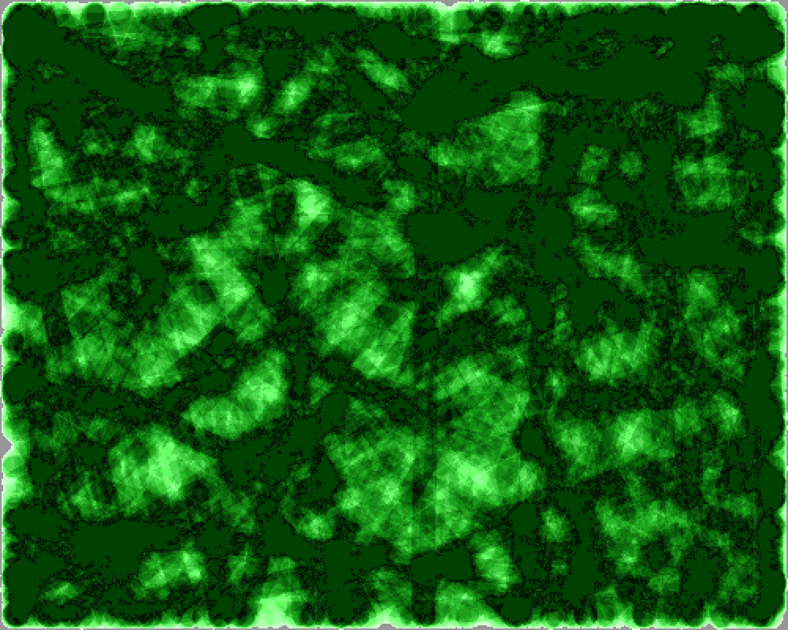
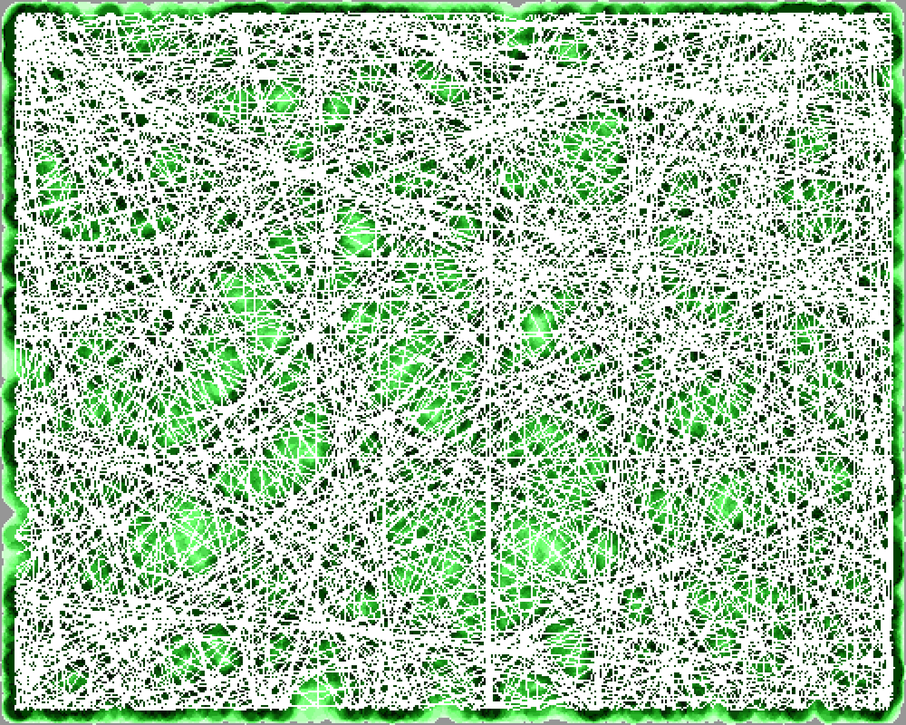
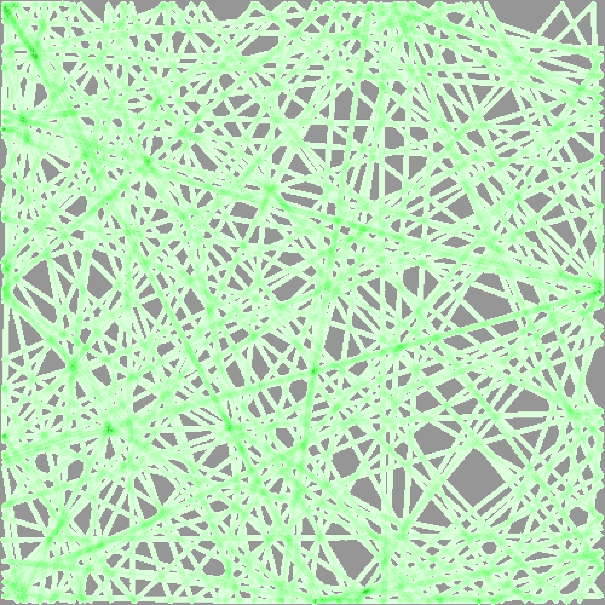

# GridCover - Autonomous Lawn Mower Simulation

GridCover is a simulation program that models how an autonomous lawn mower cuts grass in a large rectangular area. The simulation tracks the circular cutting path of the mower as it moves across the lawn, bouncing off boundaries and changing direction to achieve complete grass coverage.





*Fig 1: Examples of paths that cover the area*

## Overview

This program simulates a robotic lawn mower with a circular cutting blade that moves across a rectangular lawn area. The mower follows a realistic physics model where:

- The mower moves in straight lines until it hits a boundary
- Upon hitting a boundary, it bounces off at an angle (with optional random perturbation)
- The simulation tracks which areas of the lawn have been completely covered by the cutting blade
- The program generates both terminal output and PNG images showing the coverage pattern

The simulation is particularly useful for:
- Optimizing lawn mower path algorithms
- Analyzing coverage efficiency for different lawn sizes and mower configurations
- Testing autonomous mower behavior in various scenarios
- Educational purposes for robotics and path planning

## Features

- **High-performance simulation** with optional parallel processing using multiple CPU cores
- **Realistic physics** with configurable mower radius, speed, and direction perturbation
- **Multiple stopping conditions** (bounces, time, coverage percentage, distance, or simulation steps)
- **Visual output** with color-coded PNG images showing coverage patterns
- **Progress tracking** with optional progress bars and detailed statistics
- **Reproducible results** using random seeds for deterministic simulations
- **Flexible configuration** with extensive command-line options

## Installation from source

Ensure you have Rust installed on your system. If not, install it from [rustup.rs](https://rustup.rs/).

Clone the repository and build the project:

```bash
git clone <repository-url>
cd gridcover
cargo build --release
```

## Usage

### Basic Usage from source

This assumes that the binaries have been built and placed in the path searched for binaries.

Run a basic simulation with default parameters:

```bash
gridcover --stop-coverage 50
```

This will simulate a lawn mower with:
- Run the simulation until 50% of the lawn has been cut
- Circular cutting blade radius of 0.3 units (default)
- 50×50 units total area, divided in 500x500 cells
- Each cell representing 0.1×0.1 units
- Random starting direction
- Random starting position
- Output image of paths covered saved as `coverage_grid.png`

### Common Examples

**Quick 10-bounce simulation:**
```bash
gridcover --stop-bounces 10 --verbosity 1
```

**Coverage-based simulation (stop at 80% coverage):**
```bash
gridcover --stop-coverage 80 --verbosity 1
```

**Time-based simulation (stop after 3600 simulated seconds = 1h):**
```bash
gridcover --stop-time 3600 --verbosity 1
```

**Large lawn with bigger mower:**
```bash
gridcover --width 1000 --height 800 --radius 0.5 --stop-coverage 85
```

**Reproducible simulation with specific seed:**
```bash
gridcover --random-seed 12345 --stop-bounces 20 --verbosity 2
```

**Custom output file:**
```bash
gridcover  my_lawn_simulation.png --stop-bounces 15
```

**High-precision simulation:**
```bash
gridcover --square-size 0.05 --width 1000 --height 1000 --stop-coverage 90
```

**Using the short version of command line arguments:**
```bash
gridcover -r 4 -w 500 -g 400 -s 0.5 -x 1 -y 1 -c 99 --verbosity 1 -S 99 -C false -R true
```

## Command Line Arguments

### Grid Configuration
- `-w, --width <WIDTH>` - Grid width in cells (default: 500)
- `-g, --height <HEIGHT>` - Grid height in cells (default: 500) 
- `-s, --square-size <SQUARE_SIZE>` - Size of each grid square in units (default: 0.1)

### Mower Configuration
- `-r, --radius <RADIUS>` - Radius of the circular cutting blade in units (default: 0.3)
- `-v, --velocity <VELOCITY>` - Movement velocity in units/second (default: 0.5)
- `-x, --start-x <START_X>` - Starting X coordinate for mower center (default: 0, randomized)
- `-y, --start-y <START_Y>` - Starting Y coordinate for mower center (default: 0, randomized)
- `--dir-x <DIR_X>` - Direction X component (default: 0, randomized)
- `--dir-y <DIR_Y>` - Direction Y component (default: 0, randomized)
- `-T, --cutter-type <CUTTER-TYPE>` Cutter type to use for the simulation. Options: 'blade', 'circular'. [default: blade]
- `--blade-len <BLADE_LEN>` - Length of knife blade in units (default: 0.05)
- `-B, --battery-run-time <BATTERY_RUN_TIME>` Battery duration in minutes for the cutter [default: 0]
- `-A, --battery-charge-time <BATTERY_CHARGE_TIME>` Battery charging time in minutes for the cutter when it runs out [default: 0]


### Stopping Conditions
At least one stopping condition must be specified:

- `-b, --stop-bounces <BOUNCES>` - Stop after this many wall bounces (default: 0, disabled)
- `-t, --stop-time <TIME>` - Stop after simulated time in seconds (default: 0, disabled)
- `-c, --stop-coverage <COVERAGE>` - Stop when coverage percentage reached (1-99%) (default: 0, disabled)
- `-m, --stop-simsteps <STEPS>` - Stop after this many simulation steps (default: 0, disabled)
- `-d, --stop-distance <DISTANCE>` - Stop after mower travels this distance (default: 0, disabled)

### Output Configuration
- `-o [IMAGE-FILE-NAME]` - Output PNG image filename (default: coverage_grid.png)
- `--image-width <WIDTH>` - Output image width in mm (50-500, default: 200)
- `--image-height <HEIGHT>` - Output image height in mm (50-500, default: 200)
- `--dpi <DPI>` - Output image DPI (default: 300)
- `-C, --track-center <TRACK_CENTER>` Add option to turn centerpoint tracking on or off [default: true] [possible values: true, false]
- `-J, --json-output <JSON_OUTPUT>` Print results as a json object [default: false] [possible values: true, false]
- `--verbosity <LEVEL>` - Verbosity level 0-2 (default: 0)
  - 0: Minimal output with only result shown
  - 1: Show simulation parameters and results + additional info
  - 2: Include an ASCII version to count the initial legs color coded and numbered (only applicable for grids ≤100×100)

### Simulation Parameters
- `-z, --step-size <STEP_SIZE>` - Simulation step size in units if not specified will be calculated from the square size (default: 0)
- `-S, --random-seed <SEED>` - Random seed for reproducible results (default: 0, random)
- `-p, --perturb <PERTURB>` - Enable random angle perturbation on bounces (default: true)
- `--perturb-segment <PERTURB_SEGMENT>` Use perturbation randomly while moving in a straight line [default: false] [possible values: true, false]
- `--perturb-segment-percent <PERTURB_SEGMENT_PERCENT>` Perturb segment percent chance per cell travelled


### Performance and Behavior Options
- `-P, --parallel <PARALLEL>` - Enable parallel processing (default: true)
- `-C, --track-center <TRACK_CENTER>` - Track mower center position in image (default: true)
- `-R, --show-progress <SHOW_PROGRESS>` - Show progress bar during simulation (default: true)
- `-o <IMAGE-FILE-NAME>` - Output image file name

## Understanding the Output

### Terminal Output
The program provides detailed statistics including:
- Simulation parameters (grid size, mower radius, etc.)
- Final coverage percentage and cell counts
- Total distance traveled by the mower
- Number of wall bounces
- Simulation time (both real and simulated)
- Total simulation steps executed

**Example Output**
```txt
$ gridcover -c 50
Coverage: 50.02% (125040/250000 cells covered) - Bounces: 100 - Sim-Time: 02:02:34

Simulation Results:
  Simulation completed in  : 00:04
  Simulated elapsed time   : 2:02:34
  Coverage                 : 50.0% (125040 out of 250000 cells)
  Distance traveled:       : 3677.4 units
  Number of bounces:       : 100
  Total Simulation Steps   : 40,860 (Using step size = 0.09 units)
```

### Visual Output
The generated PNG image uses a color-coded system:
- **Black areas**: Uncovered lawn areas
- **Colored areas**: Covered areas, with different shades representing how often a spot has been visited. The darker the cell the more visits
- **White dots**: Mower center positions (if tracking enabled)

The image is scaled to the specified dimensions (default 200×200mm) suitable for printing or analysis.

### Grid Display (Terminal)
For small grids (≤100×100 cells) with verbosity level 2, a text representation is shown:
- `--`: Uncovered cells
- `0-9`: Covered cells (number indicates bounce phase)
- `*`: Mower center positions

## Performance Considerations

- **Parallel processing**: Enabled by default, uses multiple CPU cores for faster simulation
- **Grid size**: Larger grids require more memory and computation time
- **Step size**: Automatically calculated based on mower radius for optimal accuracy
- **Release builds**: Use `--release` flag for significantly better performance

## Technical Details

### Principle
- The area is divided in WxH cells (or squares)
- Each cell has a given size R*R 
- This gives an operational area in simulation units of (WxR) x (HxR)
- A unit can be thought of as cm, dm, m, km etc. As long as it is consistent and velocity is given as unit/s
- The velocity does not impact the simulation speed, it will only impact the displayed simulation time

### Physics Model
- The mower moves in straight lines at constant velocity
- Wall collisions reverse the appropriate velocity component
- Optional random perturbation (±60°) adds realistic behavior variation
- Coverage is determined by checking if all corners of each grid cell are within the cutting radius

### Simulation Accuracy
- Step size is automatically set to 9/10 of the square size. This guarantees that a simulation step never skips a cell 
- Grid resolution can be adjusted via `--square-size` for higher precision
- The simulation uses floating-point arithmetic for smooth movement

### Memory Usage
- Memory usage scales with grid size: O(width × height)
- Each cell stores coverage status and bounce tracking information
- Large simulations (1000×1000+) may require several GB of RAM

## Examples by Use Case

### Quick Testing
```bash
# Fast 10-bounce test
cargo run --release -- --stop-bounces 10 --width 100 --height 100
```

### Coverage Analysis
```bash
# Analyze coverage patterns
cargo run --release -- --stop-coverage 95 --verbosity 2 --track-center false lawn_coverage.png
```

### Performance Benchmarking
```bash
# Large-scale performance test
cargo run --release -- --width 2000 --height 2000 --stop-coverage 85 --verbosity 1
```

```bash
# Large-scale performance test disabling parallel processing
cargo run --release -- --width 2000 --height 2000 --stop-coverage 85 --verbosity 1 --parallel false
```


### Algorithm Development
```bash
# Reproducible test for algorithm comparison
cargo run --release -- --random-seed 42 --stop-bounces 50 --verbosity 2
```

## Limitations
- Partial covered cells are not counted, only fully covered cells are counted as cut. With small enough cells this is not an issue.

## Troubleshooting

### Common Issues
1. **"No stopping condition set"**: Specify at least one stopping condition (-b, -t, -c, -m, or -d)
2. **Large memory usage**: Reduce grid size or increase square-size for large simulations
3. **Slow performance**: Ensure you're using `--release` builds and consider disabling parallel processing for very small grids

### Performance Tips
- Use release builds (`cargo run --release`) for production simulations
- Enable parallel processing for large grids (enabled by default)
- Consider increasing square-size for very large simulations to reduce memory usage. Take notice that cell size must be smaller than 2*radius as otherwise a cell can never be fully covered by the cutter
- Use appropriate stopping conditions to avoid extremely long simulations

## License

MIT License

# Example output

## Without center tracking


Generated with

```bash
gridcover -r 4 -w 500 -g 400 -s 0.5 -x 1 -y 1 -v 1 -c 99 -S 99 -C false
```


```bash
gridcover -c 75 -C false
```

## With center point tracking


Generated with

```bash
gridcover -r 4 -w 500 -g 400 -s 0.5 -x 1 -y 1 -v 1 -c 99 -S 99
```

# Full list of command line options

```txt
Usage: gridcover [OPTIONS] [IMAGE-FILE-NAME]

Usage: gridcover [OPTIONS]

Options:
  -o <IMAGE-FILE-NAME>
          Output image file name
  -z, --step-size <STEP_SIZE>
          Simulation step size in units if not specified will be calculated from the square size [default: 0]
  -r, --radius <RADIUS>
          Radius of the circle [default: 0.2]
  -l, --blade-len <BLADE_LEN>
          Length of knife blade [default: 0.05]
  -w, --grid-width <GRID_WIDTH>
          Grid width in cells [default: 500]
  -g, --grid-height <GRID_HEIGHT>
          Grid height in cells [default: 500]
  -s, --square-size <SQUARE_SIZE>
          Size of each grid square [default: 0]
  -x, --start-x <START_X>
          Starting X coordinate for the circle center [default: 0]
  -y, --start-y <START_Y>
          Starting Y coordinate for the circle center [default: 0]
  -v, --velocity <VELOCITY>
          Movement velocity in units/second [default: 0.5]
      --dir-x <DIR_X>
          Direction X component [default: 0]
      --dir-y <DIR_Y>
          Direction Y component [default: 0]
  -p, --perturb <PERTURB>
          Use perturbation angle for direction changes at bounce [default: true] [possible values: true, false]
      --perturb-segment <PERTURB_SEGMENT>
          Use perturbation randomly while moving in a straight line [default: false] [possible values: true, false]
      --perturb-segment-percent <PERTURB_SEGMENT_PERCENT>
          Perturb segment percent chance per cell travelled [default: 0.5]
  -b, --stop-bounces <STOP_BOUNCES>
          Maximum number of bounces before ending simulation [default: 0]
  -t, --stop-time <STOP_TIME>
          Maximum simulated time when to stop [default: 0]
  -c, --stop-coverage <STOP_COVERAGE>
          Stop when we have reached this coverage percentage This is a soft limit, the simulation will still run until the specified bounces or time is reached if specified [default: 0]
  -m, --stop-simsteps <STOP_SIMSTEPS>
          Stop when we have reached the specified number of simulation steps [default: 0]
  -d, --stop-distance <STOP_DISTANCE>
          Stop when we have reached the specified distance covered [default: 0]
      --verbosity <VERBOSITY>
          Verbosity during simulation [default: 0]
  -P, --parallel <PARALLEL>
          Use parallel processing to speed up simulation [default: true] [possible values: true, false]
  -S, --random-seed <RANDOM_SEED>
          Random seed for the simulation to be able to reproduce results If not specified, a random seed will be generated [default: 0]
      --image-width-mm <IMAGE_WIDTH_MM>
          Image output width in mm (50-1000) [default: 200]
      --image-height-mm <IMAGE_HEIGHT_MM>
          Image output height in mm (50-1000) [default: 200]
  -C, --track-center <TRACK_CENTER>
          Add option to turn centerpoint tracking on or off [default: true] [possible values: true, false]
  -R, --show-progress <SHOW_PROGRESS>
          Show progress bar during simulation (default: true) [default: true] [possible values: true, false]
  -T, --cutter-type <CUTTER-TYPE>
          Cutter type to use for the simulation. Options: 'blade', 'circular'. [default: blade] [possible values: blade, circular]
  -J, --json-output <JSON_OUTPUT>
          Print results as a json object [default: false] [possible values: true, false]
  -D, --dpi <DPI>
          DPI setting for image output (default: 300) [default: 300]
  -B, --battery-run-time <BATTERY_RUN_TIME>
          Battery duration in minutes for the cutter [default: 0]
  -A, --battery-charge-time <BATTERY_CHARGE_TIME>
          Battery charging time in minutes for the cutter when it runs out [default: 0]
  -h, --help
          Print help
  -V, --version
          Print version
```